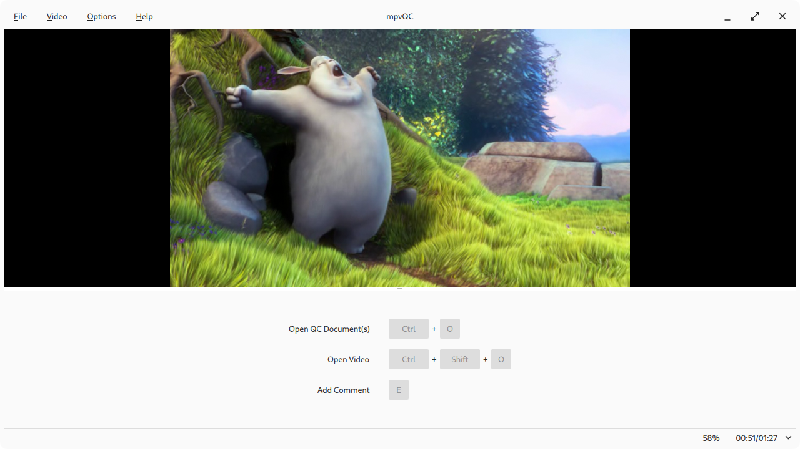
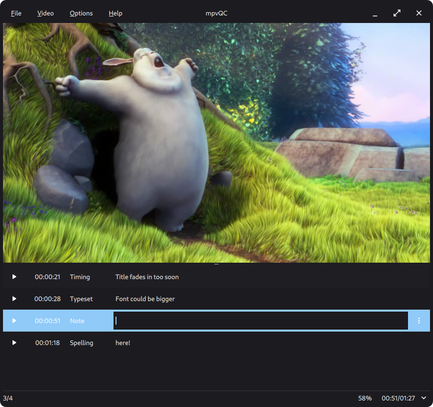

  <h1>mpvQC</h1>
  
   
  <a href="https://mpvqc.github.io">https://mpvqc.github.io</a>
   
  libmpv based application for the quick and easy creation of quality control reports of video files
   

  <h2>Screenshots</h2>

  <h2>Download</h2>
  <a href="https://mpvqc.github.io">https://mpvqc.github.io</a>

  <h2>Developers</h2>
  Please look <a href="docs/developer">here</a>

