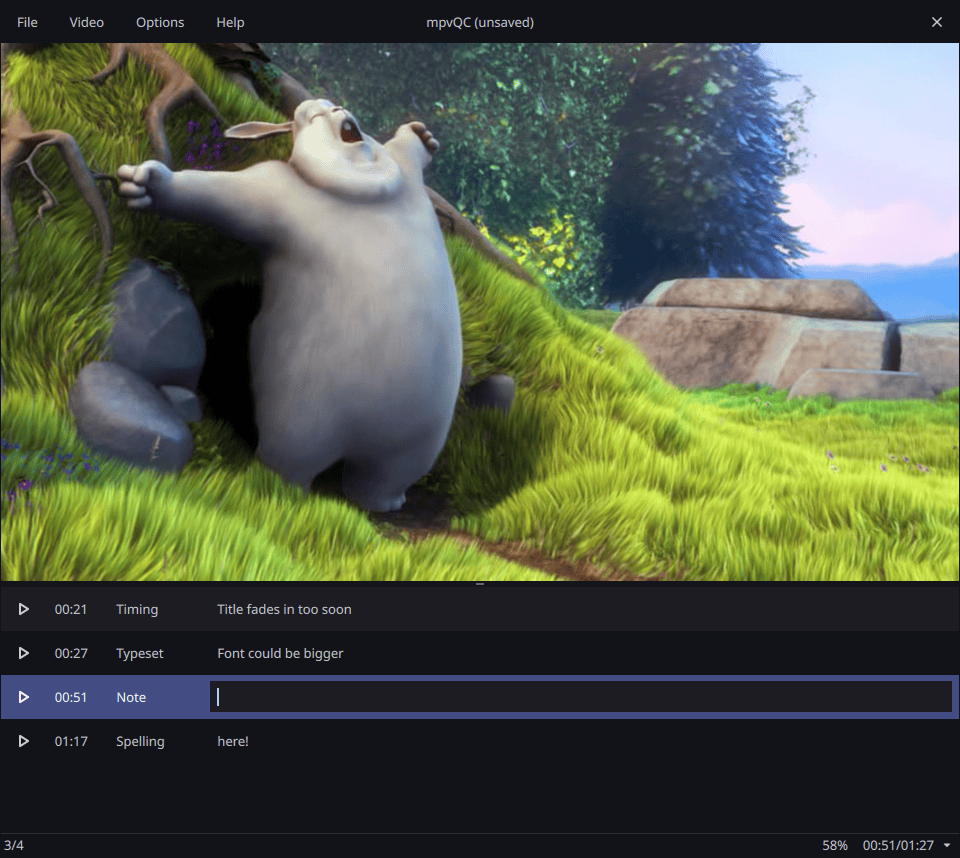

<!--
SPDX-FileCopyrightText: mpvQC developers

SPDX-License-Identifier: MIT
-->

# mpvQC


A simple libmpv-based application for creating video file quality control reports.\
https://mpvqc.github.io

______________________________________________________________________



______________________________________________________________________

## Development Setup

1. **Install these tools**

   - [Python 3.13 or later](https://www.python.org/downloads/)
   - [uv](https://github.com/astral-sh/uv)
   - [just](https://github.com/casey/just)
   - **Windows users also need**
     - [Git Bash](https://git-scm.com/downloads)
     - Be sure to run `just` inside Git Bash

2. **Clone the repository**

3. **Open a terminal** where you cloned it

4. **Initialize the environment**:

   ```shell
   just init
   ```

5. **Add libmpv to your path**

   - **Linux**: Install `libmpv` through your package manager
   - **Windows**: Download [libmpv (mpv-dev-x86_64)](https://github.com/shinchiro/mpv-winbuild-cmake/releases), extract it, and place the `libmpv-*.dll` in the repository’s root folder

6. **Compile Resources:**

   ```shell
   just build-develop
   ```

7. **Start the application:**

   ```shell
   uv run main.py
   ```

Whenever you change files in the `data`, `i18n`, or `qml` directories, run:

```shell
just build-develop
```

This compiles them into a Python file in the mpvqc folder, so the app recognizes them on startup.

**Tip:** Configure your IDE to run the `build-develop` recipe before launching the application.

## Internationalization

If you want to translate this application into more languages, see the [internationalization guide](docs/internationalization.md).
Feel free to open a new issue if you need further assistance.

## Licenses

This project uses multiple licenses for different parts:

- **Our own source code**: [GNU GPL-3.0-or-later](LICENSES/GPL-3.0-or-later.txt)
- **Build scripts and helper code**: [MIT](LICENSES/MIT.txt)
- **Fonts (Noto Sans)**: [SIL Open Font License 1.1](LICENSES/OFL-1.1.txt)
- **Icons (Google Material Icons/Symbols)**: [Apache-2.0](LICENSES/Apache-2.0.txt)

Each source file usually contains an SPDX license header.
If a file does not have a header, its licensing information can be found in our [REUSE.toml](REUSE.toml).
