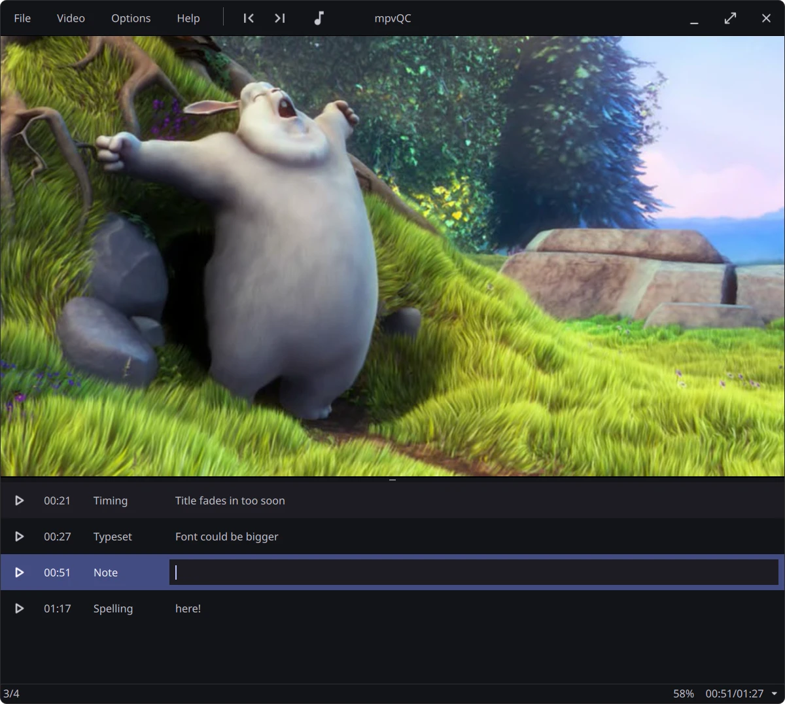

<!--
SPDX-FileCopyrightText: mpvQC developers

SPDX-License-Identifier: MIT
-->

# mpvQC

A simple libmpv-based application for creating video file quality control reports.\
<https://mpvqc.github.io>

______________________________________________________________________

<picture>
  <source media="(prefers-color-scheme: dark)" srcset=".github/screenshots/mpvQC-dark.webp"/>
  <source media="(prefers-color-scheme: light)" srcset=".github/screenshots/mpvQC-light.webp"/>
  
</picture>

______________________________________________________________________

## Development

See [docs/development.md](docs/development.md) for setup, daily commands, and project layout,
and [docs/architecture.md](docs/architecture.md) for a high-level overview of the codebase.

## Document format

QC documents are saved in a versioned JSON format specified in [docs/document-format](docs/document-format/README.md),
including a JSON Schema for third-party tooling.

## Internationalization

If you want to translate this application into more languages, see the [internationalization guide](docs/internationalization.md).
Feel free to open a new issue if you need further assistance.

## Licenses

This project uses multiple licenses for different parts:

- **Our own source code**: [GNU GPL-3.0-or-later](LICENSES/GPL-3.0-or-later.txt)
- **Build scripts and helper code**: [MIT](LICENSES/MIT.txt)
- **Fonts (Noto Sans)**: [SIL Open Font License 1.1](LICENSES/OFL-1.1.txt)
- **Icons (Google Material Icons/Symbols)**: [Apache-2.0](LICENSES/Apache-2.0.txt)

Bundled runtime dependencies (such as libmpv and PySide6) carry their own licenses;
see [NOTICE.txt](NOTICE.txt) for the full third-party breakdown.

Each source file usually contains an SPDX license header.
If a file does not have a header, its licensing information can be found in our [REUSE.toml](REUSE.toml).
