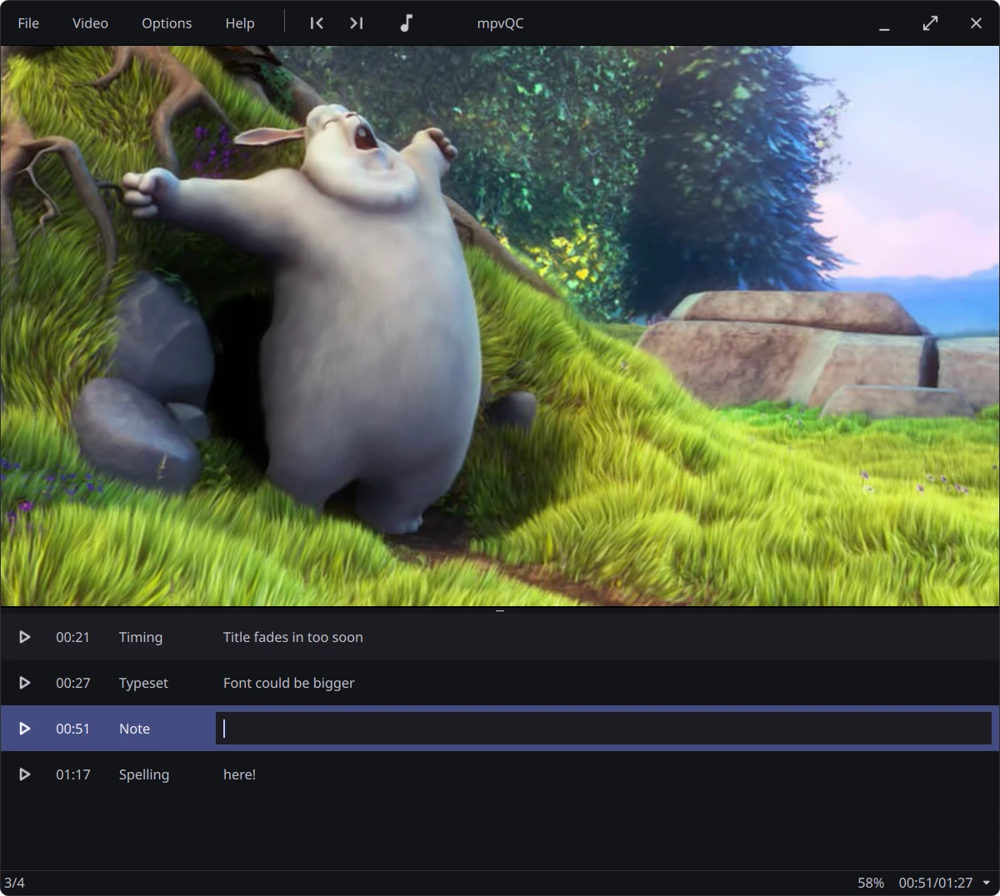

# mpvQC

mpvQC is a desktop app for creating video quality control reports, built on libmpv.
Watch a video, add timestamped comments, and save your report.

**[Install mpvQC](https://mpvqc.github.io/installation/)** for Windows or Linux.
The guide also covers updates.

[Website](https://mpvqc.github.io/) · [Releases](https://github.com/mpvqc/mpvQC/releases)

<picture>
  <source media="(prefers-color-scheme: dark)" srcset=".github/screenshots/mpvQC-dark.webp"/>
  <source media="(prefers-color-scheme: light)" srcset=".github/screenshots/mpvQC-light.webp"/>
  
</picture>

## Features

- Add timestamped comments with categories while reviewing a video.
- Load videos, subtitles, and existing QC documents.
- Save reports as versioned JSON or export them with templates.

The [document format](docs/document-format/README.md) includes a JSON Schema for third-party tools.

## Contributing

- [Contribution guidelines](CONTRIBUTING.md)
- [Development setup and commands](docs/development.md)
- [Architecture](docs/architecture.md)
- [Translation guide](docs/internationalization.md)
- [Bug reports and feature requests](https://github.com/mpvqc/mpvQC/issues)

## Licenses

Licenses by component:

- **Our own source code**: [GNU GPL-3.0-or-later](LICENSES/GPL-3.0-or-later.txt)
- **Build scripts, helper code, and documentation**: [MIT](LICENSES/MIT.txt)
- **Fonts (Noto Sans)**: [SIL Open Font License 1.1](LICENSES/OFL-1.1.txt)
- **Icons (Google Material Icons/Symbols)**: [Apache-2.0](LICENSES/Apache-2.0.txt)

See [NOTICE.txt](NOTICE.txt) for third-party licenses. Individual files carry SPDX headers or have their licenses
listed in [REUSE.toml](REUSE.toml).
