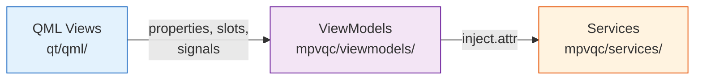
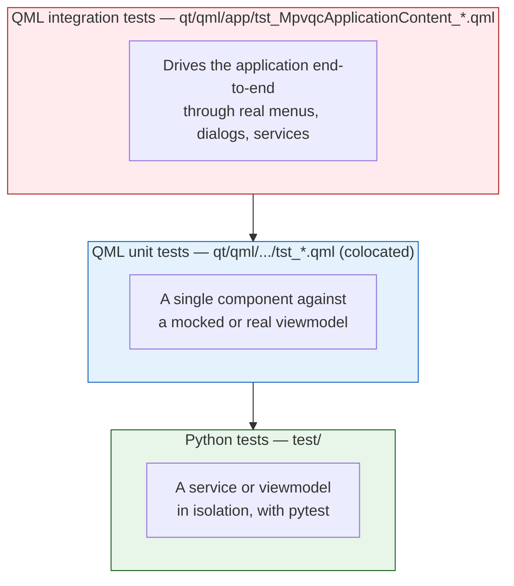

<!--
SPDX-FileCopyrightText: mpvQC developers

SPDX-License-Identifier: MIT
-->

# Architecture

mpvQC is a PySide6 desktop application that follows an MVVM split: QML owns presentation, Python owns logic, and a dependency-injection container wires them together. This document is a starting point for reading the codebase — it explains what the layers are, how they communicate, and where tests live. It is intentionally high-level; the code is the source of truth.

For setup and daily workflow, see [development.md](development.md).

## MVVM split

### Views — `qt/qml/`

QML files describe what the user sees and how they interact. Views hold no business logic; they bind to a viewmodel's properties, call its slots in response to user actions, and react to its signals. Subdirectories group views by surface area, with reusable building blocks alongside.

### ViewModels — `mpvqc/viewmodels/`

ViewModels are Python `QObject` subclasses exposed to QML via PySide6's `@QmlElement`. They translate between Qt's signal/slot world and the underlying services: a viewmodel pulls in services with `inject.attr`, exposes the data the view needs as Qt properties, and turns user actions (`Slot`s) into service calls. The folder structure broadly mirrors `qt/qml/`'s where it helps locate things.

### Services — `mpvqc/services/`

Services hold the application's logic and own its mutable state. They have no QML awareness — they are plain Python classes that other services and viewmodels can pull in via `inject.attr`. Each service sits in its own module, and `mpvqc/injections.py` registers the bindings for the inject container.

### Bootstrap

The application's entry point sets up the inject container, hands it to the QML engine, and loads the root window. From there, viewmodels resolve their service dependencies on demand. Window-level concerns are wired up during startup so they're available before the first user interaction.

## Testing

Tests sit at three layers:

### Python tests — `test/`

Standard pytest suite. Each service and viewmodel has its own test module that exercises it in isolation, often with stubbed collaborators. Run with `just test-python`.

### QML unit tests — colocated `tst_*.qml`

Each non-trivial QML file has a sibling `tst_<Name>.qml` that exercises that component in isolation. Where the component depends on a viewmodel, the test instantiates a mock viewmodel inline; a small number of tests use a real viewmodel to cover model-binding paths that mocks can't fake. Run together with the integration tests via `just test-qml`.

### QML integration tests — `qt/qml/app/tst_MpvqcApplicationContent_*.qml`

These drive the application content end-to-end against real, injected services. They click menu items, accept dialogs, and assert against application state through a Python test bridge. The harness lives entirely under `testqml/`: a Python entry point that boots a stripped-down application with the player swapped for a stub, bridges that expose inject state to QML, service overrides that keep tests off the real OS, and shared fixtures.

`TestHelpers.qml` files keep test code terse by exposing the shared interactions — opening menus, finding dialogs, asserting state — as nested namespaces. There is one in `qt/qml/app/` for application-level tests and one inside the table view for component-level tests; each file's tests use the namespace shape that fits its scope.

## Build & resources

QML, icons, fonts, default configs, and translations are bundled into a single Python file via Qt's resource compiler:

- `just build-develop` runs Qt's resource compiler to produce a generated Python module (`rc_project.py`) at the repo root that bundles every asset behind `qrc:/...` URLs. The application imports this module on startup. The file is gitignored — it's a build artifact, regenerable from sources.
- `just prepare-tests` rebuilds the bundle and stages it for the test harnesses, so they can import it the same way the application does.
- Release builds pre-compile QML files to bytecode for faster startup; development and test runs load plain QML directly.

The `[tool.pyside6-project] files = [...]` entry in `pyproject.toml` is auto-maintained by a helper under `build-aux/` based on the project's source directories; generated files are excluded so the list stays a description of sources.

## See also

- [development.md](development.md) — setup, build, test commands
- [configuration.md](configuration.md) — runtime environment variables
- [internationalization.md](internationalization.md) — translation workflow
- [releasing.md](releasing.md) — release checklist
