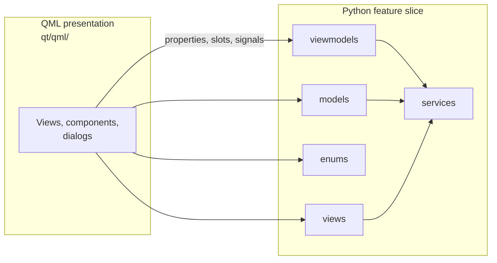
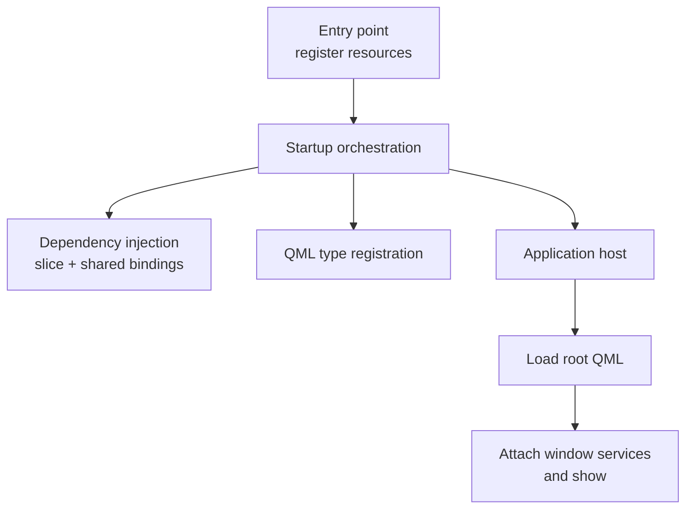
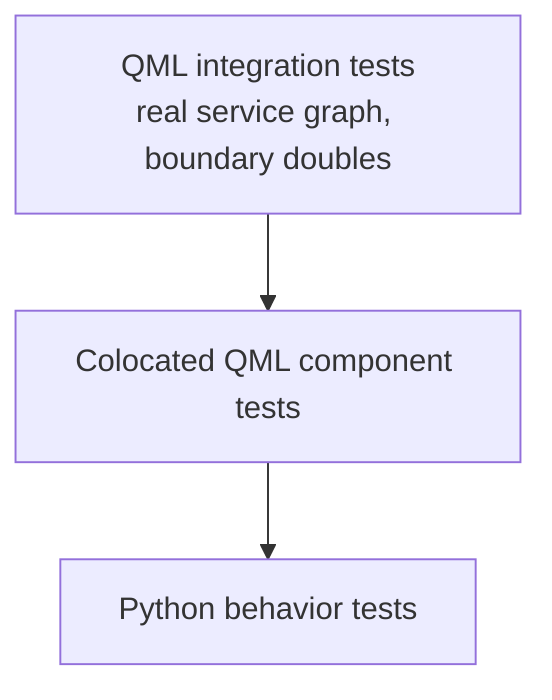

# Architecture

mpvQC is a PySide6 desktop application. Python is organized into vertical feature slices. QML stays organized by
presentation concern. QML owns presentation, Python owns application state and logic, and an injection container joins
the two.

This document is a map for reading the codebase. The code and the architecture decision records are the source of
truth. For setup and daily commands, see [development.md](development.md).

## System shape

```mermaid
flowchart LR
    subgraph QML["QML presentation<br/>qt/qml/"]
        UI["Views, components,<br/>dialogs"]
    end

    subgraph Slice["Python feature slice"]
        VM["viewmodels"]
        MODEL["models"]
        ENUM["enums"]
        VIEW["views"]
        SERVICE["services"]
    end

    UI -->|"properties, slots, signals"| VM
    UI --> MODEL
    UI --> ENUM
    UI --> VIEW
    VM --> SERVICE
    MODEL --> SERVICE
    VIEW --> SERVICE
```

QML never imports a Python service directly. It talks to QML-registered view models, models, enums, and native view
objects. All registered Python types share the `io.github.mpvqc.mpvQC.Python` QML module.

Every Python role may use shared vocabulary. View models, views, and services may also use shared boundary services.

QML modules use full reverse-DNS URIs. They are grouped by presentation concern. The style override directory is the
exception to the dotted tree because Qt resolves styles from a root directory.

## Feature slices

A feature slice claims only the roles it needs:

| Role | Owns |
| --- | --- |
| `services` | Application logic, public state, pure rules, and settings keys |
| `models` | Data exposed through Qt model APIs |
| `viewmodels` | Properties, slots, and signals shaped for QML |
| `enums` | A slice's QML enum boundary |
| `views` | Native Qt objects instantiated as part of the QML scene |
| `wiring.py` | Container bindings and QML type registration |

Each role's `__init__.py` is its public API. Callers outside the role import from that root instead of reaching into its
modules. A few platform packages are held roots and expose their own public API. The import-rule tests enforce both
forms.

Each slice root exports `bindings` and `register_qml_types` from `wiring.py`. Wiring imports first-party and Qt modules
inside those functions. This keeps importing a slice cheap and prevents QML registration from
running as an import side effect.

## Dependencies

Every role may import freely within its own directory and may import the pure vocabulary in `mpvqc.shared`. Imports
between roles and into shared services follow this lattice:

| From | Same slice | Another slice | Shared services |
| --- | --- | --- | --- |
| `enums` | - | - | - |
| `models` | `enums`, `services` | `enums` | - |
| `services` | `services` | `services` | yes |
| `viewmodels` | `models`, `services`, `enums` | `services`, `enums` | yes |
| `views` | `models`, `services`, `enums` | `services`, `enums` | yes |

A foreign slice's models, view models, and views are closed. Commands cross slices through calls to public services.
Facts cross through public service state and change signals. There is no event bus, and the service graph stays
acyclic.

Horizontal Python code is limited to shared vocabulary, shared boundary services, narrow application-wide helpers, and
application composition.

Import-rule tests check the slice lattice, role-root imports, held roots, and lazy wiring. Feature tests receive
narrower checks. Composition roots are exceptions because they must assemble or replace collaborators.

## Composition

```mermaid
flowchart TD
    ENTRY["Entry point<br/>register resources"] --> START["Startup orchestration"]
    START --> DI["Dependency injection<br/>slice + shared bindings"]
    START --> TYPES["QML type registration"]
    START --> APP["Application host"]
    APP --> ROOT["Load root QML"]
    ROOT --> WINDOW["Attach window services<br/>and show"]
```

## Testing

```mermaid
flowchart TB
    INTEGRATION["QML integration tests<br/>real service graph, boundary doubles"]
    QMLUNIT["Colocated QML component tests"]
    PYTHON["Python behavior tests"]

    INTEGRATION --> QMLUNIT
    QMLUNIT --> PYTHON
```

Python tests generally mirror slices and roles, but are grouped by behavior rather than source file. QML tests stay
beside the components they cover. Some isolate one component. Others drive a component group through real injected
services. The QML integration harness supplies service overrides and bridges. QML helpers and boundary doubles remain
beside the components they support.

## Build and resources

Development builds generate Python QML type metadata and bundle QML with its runtime assets. The entry point registers
the bundle before startup. Test harnesses use staged copies. Release builds remove test support before compiling
production QML to bytecode.

## See also

- [Architecture decisions](adr/)
- [Development](development.md)
- [Configuration](configuration.md)
- [Internationalization](internationalization.md)
- [Releasing](releasing.md)
