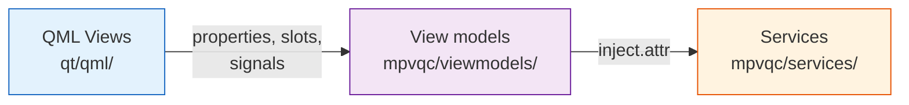
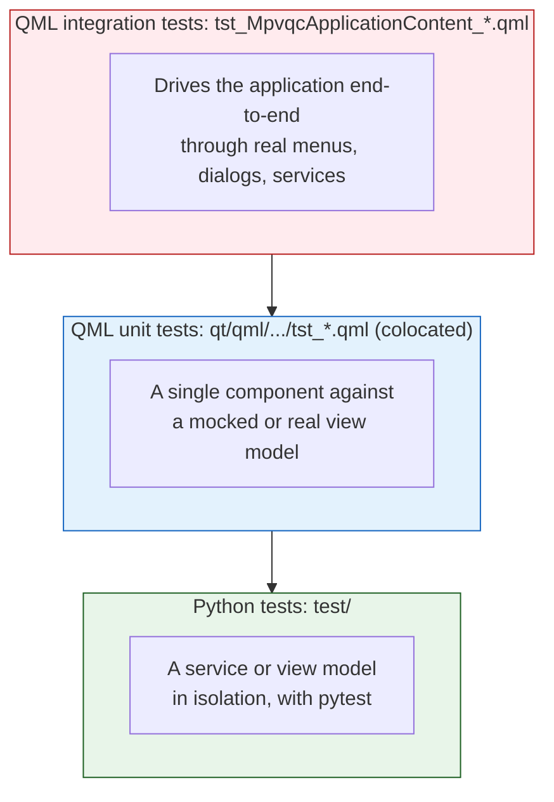

# Architecture

mpvQC is a PySide6 desktop application that follows an MVVM split: QML owns presentation, Python owns logic, and a
dependency-injection container wires them together. This document is a starting point for reading the codebase. It
explains what the layers are, how they communicate, and where tests live. It is intentionally high-level. The code is
the source of truth.

For setup and daily workflow, see [development.md](development.md).

## MVVM split

```mermaid
flowchart LR
    QML["QML Views<br/>qt/qml/"]
    VM["View models<br/>mpvqc/viewmodels/"]
    SVC["Services<br/>mpvqc/services/"]

    QML -->|"properties, slots,<br/>signals"| VM
    VM -->|"inject.attr"| SVC

    classDef qml fill:#e3f2fd,stroke:#1565c0
    classDef vm fill:#f3e5f5,stroke:#6a1b9a
    classDef svc fill:#fff3e0,stroke:#e65100
    class QML qml
    class VM vm
    class SVC svc
```

### Views: `qt/qml/`

QML files describe what the user sees and how they interact. Views hold no business logic. They bind to a view model's
properties, call its slots in response to user actions, and react to its signals.

QML modules under `qt/qml/` follow a reverse-DNS naming convention that starts at the project's namespace. Imports use
the full module URI, not relative paths. The QQuickStyle override directory is the one intentional exception. It lives
outside the dotted tree because Qt resolves styles by a single directory name at the root of an import path.

### View models: `mpvqc/viewmodels/`

View models are Python `QObject` subclasses exposed to QML via PySide6's `@QmlElement`. They translate between Qt's
signal/slot world and the underlying services: a view model pulls in services with `inject.attr`, exposes the data the
view needs as Qt properties, and turns user actions (`Slot`s) into service calls. They register into a single QML module
that follows the same reverse-DNS convention as the QML-side modules. The folder layout under `mpvqc/viewmodels/` groups
files by the consuming QML module. Not every view model lives there, though: see feature packages below.

### Services: `mpvqc/services/`

Services hold the application's logic and own its mutable state. QML never talks to them directly: they are Python
classes that other services and view models pull in via `inject.attr`. A few define Qt types that view models hand
through to QML, such as the comment store and its selection state. Not everything in the role is a class: where logic
is pure it sits beside the classes as plain module-level functions over frozen dataclasses, and the container binds
only what has state or Qt lifecycle (ADR 0019). Each service sits in its own module or package, and
`mpvqc/injections.py` binds them for the inject container. Composition happens in two places: `mpvqc/injections.py`
calls each feature package's `bindings`, and startup's registration pass calls each feature package's
`register_qml_types`.

Vocabulary that several areas mean, such as the comment type, subsecond time formatting, and the conversions among
paths, URLs, and strings, lives in `mpvqc/shared`. Every role in every slice and layer may import it.

### Feature packages: `mpvqc/<feature>/`

Some areas are grouped by what they are about instead of by layer. A feature package holds the services, models, view
models, and QML enums the area owns. The services role is the area's logic under one admission rule: a class bound in
the inject container where there is state or Qt lifecycle, a plain module-level function over frozen dataclasses where
the logic is pure (ADR 0019). Pure presentation state lives in the view model role, a plain Python module beside the
QObject adapters it feeds. A feature package also owns the settings keys its area means, reading the file through the
shared settings file service. The application attaches a feature package through two functions its root exports:
`bindings` for the inject container, and `register_qml_types` for the QML engine. Both sit in the package's
`wiring.py`, which names no mpvqc module and no Qt at module level, so importing a feature registers nothing.
Vocabulary still travels by role directory: a call site imports a service or a view model from the role that owns it.
The layer packages hold everything no feature package has claimed. `test/test_import_rules.py` enforces the import
lattice between slices; the appearance and importing packages still carry a legacy `domain` module until their
dissolution lands.

### Bootstrap

The application's entry point sets up the inject container, hands it to the QML engine, and loads the root window. From
there, view models resolve their service dependencies on demand. Startup wires the window-level services so they're
available before the first user interaction.

## Testing

Tests sit at three layers:

```mermaid
flowchart TB
    subgraph Integration["QML integration tests: tst_MpvqcApplicationContent_*.qml"]
        I1["Drives the application end-to-end<br/>through real menus, dialogs, services"]
    end
    subgraph QmlUnit["QML unit tests: qt/qml/.../tst_*.qml (colocated)"]
        Q1["A single component against<br/>a mocked or real view model"]
    end
    subgraph PyUnit["Python tests: test/"]
        P1["A service or view model<br/>in isolation, with pytest"]
    end

    Integration --> QmlUnit
    QmlUnit --> PyUnit

    classDef int fill:#ffebee,stroke:#b71c1c
    classDef qml fill:#e3f2fd,stroke:#1565c0
    classDef py fill:#e8f5e9,stroke:#1b5e20
    class Integration int
    class QmlUnit qml
    class PyUnit py
```

### Python tests: `test/`

Standard pytest suite. Each service and view model has its own test module that exercises it in isolation, often with
stubbed collaborators. Run with `just test-python`.

### QML unit tests: colocated `tst_*.qml`

Each non-trivial QML file has a sibling `tst_<Name>.qml` that exercises that component in isolation. Where the component
depends on a view model, the test instantiates a mock view model inline. A small number of tests use a real view model
to cover model-binding paths that mocks can't fake. Run together with the integration tests via `just test-qml`.

### QML integration tests: `tst_MpvqcApplicationContent_*.qml`

These drive the application content end-to-end against real, injected services. They click menu items, accept dialogs,
and assert against application state through a Python test bridge. The harness lives entirely under `testqml/`: a Python
entry point that boots a stripped-down application with the player swapped for a stub, bridges that expose inject state
to QML, service overrides that keep tests off the real OS, and shared fixtures.

`TestHelpers.qml` files keep test code short by exposing the shared interactions (opening menus, finding dialogs,
asserting state) as nested namespaces. They sit alongside the QML they help test. Each file's tests use the namespace
shape that fits its scope.

## Build & resources

QML, icons, fonts, default configs, and translations are bundled into a single binary file via Qt's resource compiler:

- `just build-develop` runs `pyside6-rcc --binary` to produce a resource bundle (`project.rcc`) at the repo root that
  packs every asset behind `qrc:/...` URLs. On startup, `main.py` registers the file with
  `QResource.registerResource()` before anything reads from `qrc:/`. The file is gitignored. It is a build artifact and
  can be regenerated from sources.
- `just prepare-tests` rebuilds the bundle and stages copies for the test harnesses, which register it the same way the
  application does.
- Release builds pre-compile QML files to bytecode for faster startup. Development and test runs load plain QML
  directly.

A helper under `build-aux/` maintains the `[tool.pyside6-project] files = [...]` entry in `pyproject.toml` from the
project's source directories. It excludes generated files so the list stays a description of sources.

## See also

- [development.md](development.md): setup, build, test commands
- [configuration.md](configuration.md): runtime environment variables
- [internationalization.md](internationalization.md): translation workflow
- [releasing.md](releasing.md): release checklist
